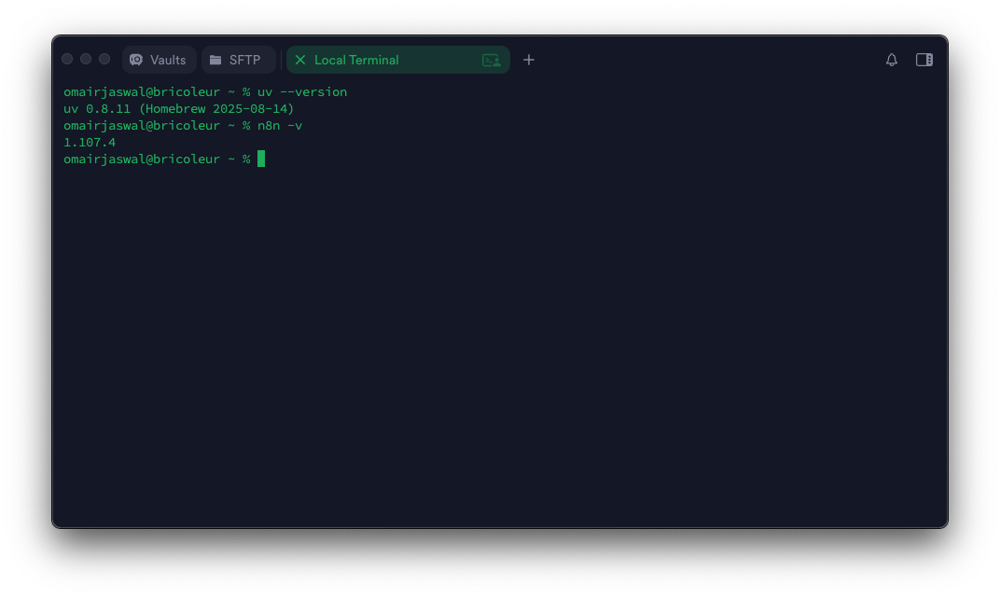
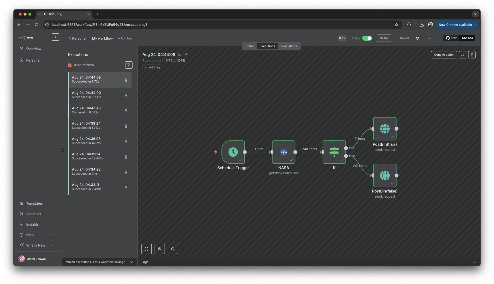

# Assignment 01: UV Installation & Getting Started with n8n
This assignment introduces two essential tools for modern development workflows:

- UV Package Manager - a fast and modern Python package manager.
- n8n - a workflow automation platform for connecting apps, APIs, and services.

## Screenshot

