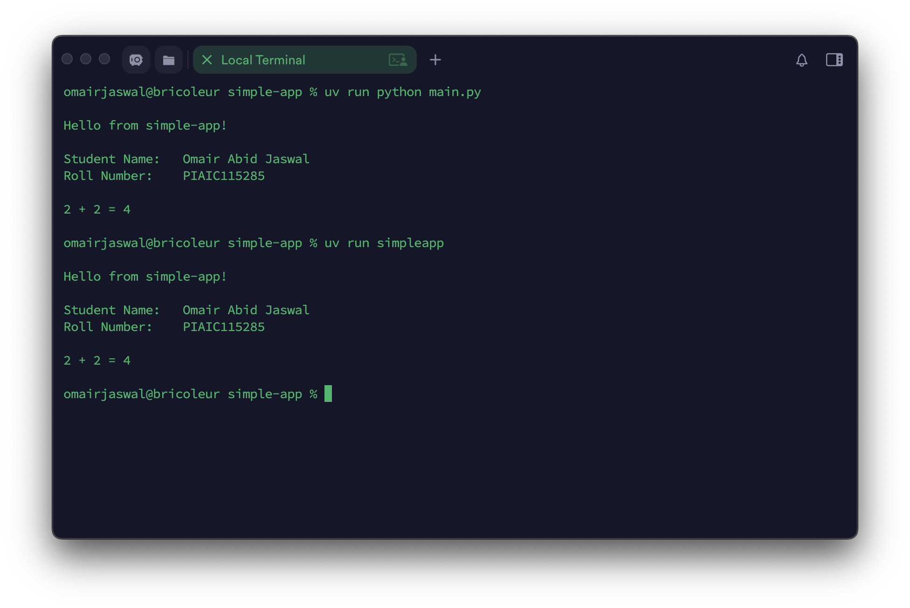

# Assignment 02 - UV Project Setup: Simple & Packaged Applications

Build two small Python apps using uv: one Simple Application and one Packaged Application. Both apps must implement any functionality you choose and print your Name and PIAIC Registration Number every time they run. Submit a GitHub link with screenshots in each app’s README.

## Submission

- Push your assignment to GitHub as a single repository containing both projects under one parent directory.
- Each project must include its own `README.md` with a terminal screenshot of the output.
- Submit the GitHub repository link.

## Screenshot

