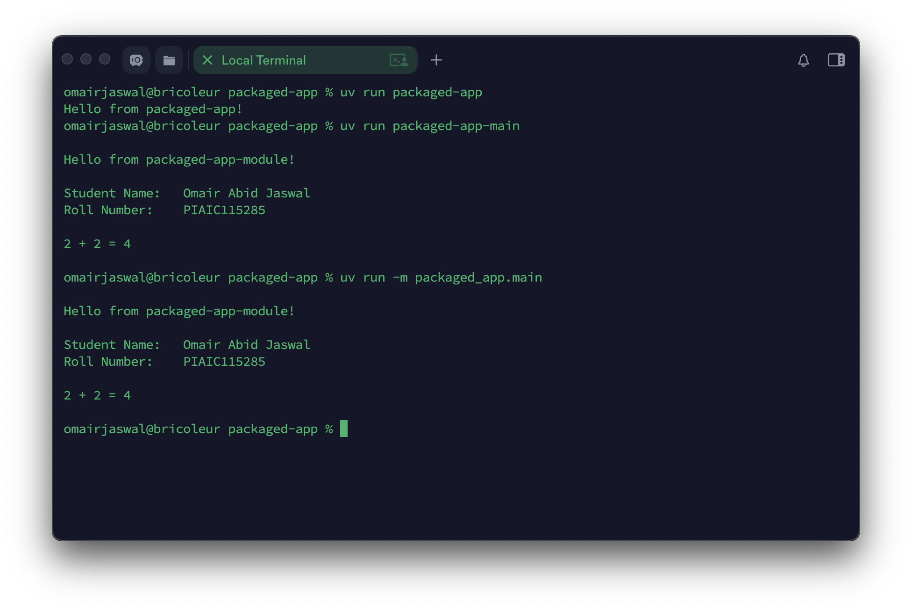

# Packaged App
This Python UV program implements a packaged app printing Student details and two numbers Addition function.

## Run commands
Run this command inside the project folder to install dependencies:
```bash
uv sync --frozen
```

To run the init program:
```bash
uv run packaged-app
```
To run the main module program
```bash
uv run packaged-app-main
```
or
```bash
uv run -m packaged_app.main
```

## Screenshot

