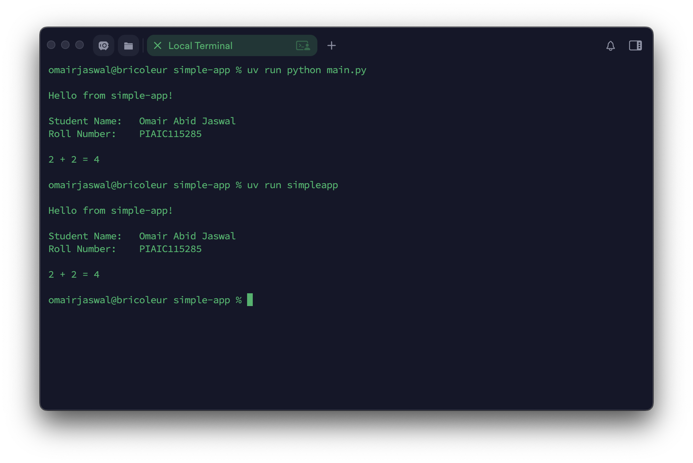

# Simple App
This Python UV program implements a simple app printing Student details and two numbers Addition function.

## Run commands
Run this command inside the project folder to install dependencies:
```bash
uv sync --frozen
```

To run the program:
```bash
uv run python main.py
```
or
```bash
uv run simpleapp
```

## Screenshot

