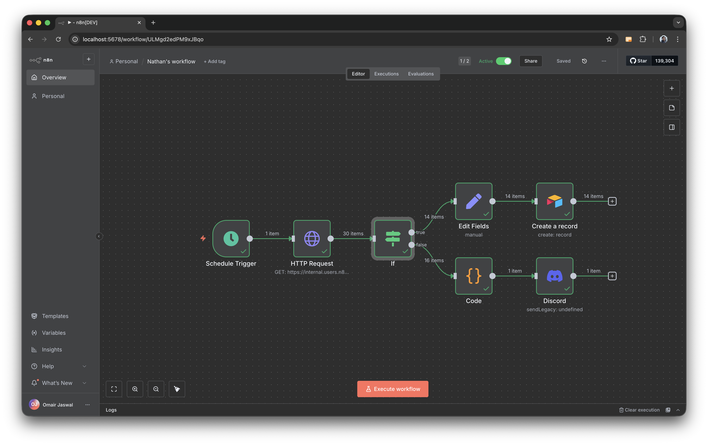
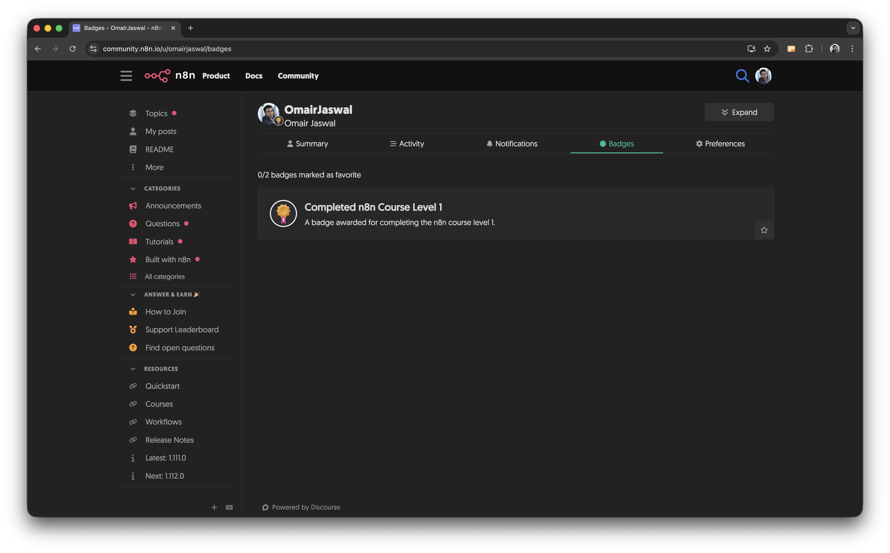

# Assignment 03 - n8n Level One Course
Complete the official n8n Level One course and provide proof of completion with the required screenshots.

## Submission requirements

- Screenshot 1: Your n8n workflow in action (execution view showing successful run).
- Screenshot 2: Your n8n Community Forum profile page showing your Level One completion badge.

Include both screenshots in a README or a short PDF within your submission folder, and ensure images are clear and readable.

## Screenshots

